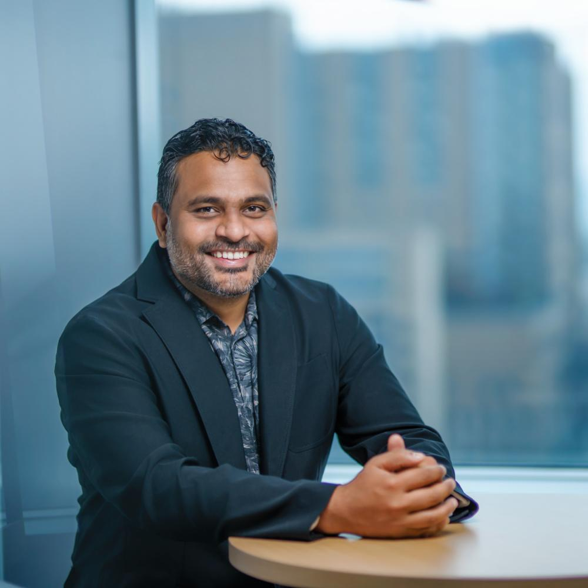

### About Me

I am an Assistant Professor at the [Department of Electrical, Computer, and Biomedical Engineering](https://web.uri.edu/engineering/ecbe/), [University of Rhode Island](https://https://www.uri.edu/). My Research interests lie at the intersection of Machine Learning and Biomedical Data Analysis. 

I completed my Ph.D. at the [Georgia Tech](https://www.gatech.edu/),
in 2023 under the guidance of
[Prof. Yongxin Chen](https://yongxin.ae.gatech.edu/). 

 

### Recent News

* August 2025: Starting a new position as an Assistant Professer at the University of Rhode Island..

