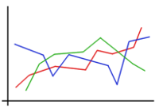

### 
Gnuplot + LaTeX:&nbsp; The Ultimate Plotting Experience

	  

Plotting graphs is an important activity for most of our analysis
work. Usually we have a function, say *y = f(x)* , and a sample of
*(x,y)* pairs. In order to analyze the behavior of the function, we
represent the *x* and its corresponding *y* values as a graph. We draw
a horizontal *x*-axis and a vertical *y*-axis. In the graph, we
represent each *(x,y)* pair as a dot or a cross in the *x-y*
plane. Instead of points, we can connect the points with lines or can
draw vertical bars (histograms) corresponding to each *y* value to get
more meaningful interpretation of the function. This post is intended
to provide information on generating extreme quality graphs using two
of the important tools, **Gnuplot** and **LaTeX**.

For the remaining of this post, I assume that you have a basic
knowledge of Gnuplot and LaTeX. For plotting using this method, we
need to have **TikZ** and **LuaTeX** libraries installed. Use the
following command (in GNU Debian/Ubuntu systems) if your system does
not have them.

$ sudo apt-get install gnuplot latexmk pgf
preview-latex* texlive-fonts-recommended luatex texlive-pictures
texlive-latex-extra

Assume that we have a text file *data.txt* with input data (the
*(x,y)* pairs) for plotting. For example, you have the speed of a car
and a bus at certain time instants. A sample file is as follows.

- - - -
**Time Car Bus**  
1 10 35  
2 45 20  
3 30 40  
4 25 10  
5 60 55 

- - - -

As the next step, write the Gnuplot script for plotting the graph.
The following is a sample code, saved as *plot.gp*.  

----------------------------------------------------------------------------------------  
# Enabling the terminal in LaTeX TikZ mode 
set term
tikz standalone color solid 
# Enabling the dashed line option 
set termoption dash 
# Setting output file  name (Here output is a LaTeX file) 
set  output 'figure.tex' 
# Set title 
set title
'Speed Vs Time' 
# Set labels for x and y axes 
set xlabel
'Time (in minutes)' 
set ylabel 'Speed (km/hr)' 
# Set the legend 
set key horiz top left Left box spacing 2 sample 2 
# Plot the graph 
plot 'data.txt'
u 1:2
w lp lt 1 pt 5 lc rgb 'dark-blue' t columnheader,\  
'data.txt' u 1:3 w lp lt 2 pt 7 lc rgb 'dark-green' t columnheader 

----------------------------------------------------------------------------------------

Execute the Gnuplot code <em>plot.gp</em> using the following command.

$ gnuplot plot.gp

Execution creates a file *figure.tex* with the TikZ script for drawing
the graph. TikZ is used to draw high quality figures in LaTeX (See <a
href="http://www.texample.net" target="_blank">TeXample</a>). Thanks
to Gnuplot's support for TikZ terminal, which allows us to generate a
*tex* file, with scripts to draw the graph, instead of normal image
formats such as *jpeg* or *png*. As the final step, we need to compile
the file *figure.tex* with *pdflatex*.

$ pdflatex figure.tex

A file <a href="figures/p1_figure.pdf"
target="_blank">*figure.pdf*</a> will be generated with the
graph. There hardly exist tools to create graphs of higher quality
similar to Gnuplot + LaTeX. Since the graph is created using LaTeX,
the default font will be the same as the default font provided by
LaTeX. Also, LaTeX allows to import figures with *.pdf* extension
using *\includegraphics{}* command. Presence of such figures improves
the effective quality of technical papers.

 ----------------------- 
Send me suggestions or corrections if any.
